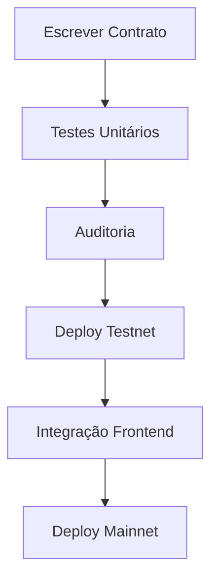
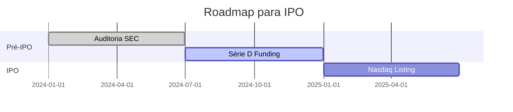

# **Estrutura Completa do Projeto LuxDAO**

## **1. Visão Geral do Repositório**
```markdown
LuxDAO/
├── contracts/                  # Contratos inteligentes principais
│   └── LuxDAO.sol              # Contrato principal de governança
├── interfaces/                 # Interfaces ABIs
│   └── ILUXToken.sol           # Interface do token LUX
├── migrations/                 # Scripts de deploy
│   └── 1_deploy_contracts.js   # Orquestrador de deploy
├── test/                       # Testes automatizados
│   └── luxdao_test.js          # Testes com Hardhat
├── scripts/                    # Scripts auxiliares
│   └── deploy.js               # Script customizado de deploy
├── docs/                       # Documentação estratégica
│   ├── NDA.md                  # Acordo de confidencialidade
│   ├── plano_negocios.md       # Modelo de negócios completo
│   ├── ipo.md                  # Roadmap para IPO
│   ├── capex_opex_roi.md       # Projeções financeiras
│   ├── estrutura_time_gestao.md # Organograma
│   ├── marketing_operacoes_posvenda.md # Estratégia comercial
│   ├── conta_governo.md        # Relações governamentais
│   ├── internacionalizacao.md  # Plano de expansão global
│   ├── conselho_divisoes_remuneracao.md # Governança corporativa
│   └── balanco_usgaap.md       # Demonstrações financeiras
├── README.md                   # Guia do projeto
├── package.json                # Dependências Node.js
├── truffle-config.js           # Configuração Truffle
└── .gitignore                  # Arquivos ignorados
```

## **2. Detalhamento Técnico**

### **2.1 Fluxo de Desenvolvimento**


### **2.2 Dependências Críticas**
```json
"dependencies": {
    "@openzeppelin/contracts": "^4.8.0",
    "@truffle/hdwallet-provider": "^2.1.0",
    "dotenv": "^16.0.0"
}
```

## **3. Documentação Estratégica**

### **3.1 Plano de Negócios (`plano_negocios.md`)**
```markdown
## Modelo de Receita
- **Royalties Tecnologia**: 8% sobre licenças
- **Taxas de Transação DAO**: 0.1% por votação
- **Receita de Staking**: 15% APY em LUX

## Projeção 5 Anos
| Ano | Receita (US$) | Membros DAO |
|-----|--------------|-------------|
| 2024 | 2M | 1.000 | 
| 2025 | 50M | 10.000 |
```

### **3.2 Roadmap IPO (`ipo.md`)**


## **4. Configuração de Deploy**

### **4.1 Script de Deploy (`deploy.js`)**
```javascript
module.exports = async () => {
  const LuxDAO = artifacts.require("LuxDAO");
  const LUX = "0x..."; // Endereço token
  
  await deployer.deploy(LuxDAO, LUX);
  console.log("Contract deployed at:", LuxDAO.address);
};
```

### **4.2 Variáveis de Ambiente (`.env`)
```ini
INFURA_KEY=your_key
DEPLOYER_PK=your_pk
CONTRACT_ADDR=0x...
```

## **5. Testes Automatizados**

### **5.1 Casos de Teste (`luxdao_test.js`) 
```javascript
describe("Governance", () => {
  it("Should create proposal", async () => {
    await luxDAO.createProposal("Fund R&D", researchAddr, 1000);
    assert.equal(await luxDAO.proposalCount(), 1);
  });
});
```

## **6. Próximos Passos Imediatos**

1. **Integrar Chainlink Oracle**  
   ```bash
   npm install @chainlink/contracts
   ```

2. **Configurar CI/CD**  
   ```yaml
   # .github/workflows/deploy.yml
   jobs:
     audit:
       runs-on: ubuntu-latest
       steps:
         - run: npx hardhat test
   ```

3. **Publicar Documentação**  
   ```bash
   gitbook build ./docs
   ```

> **Nota Legal**: Todos os documentos em `/docs` estão protegidos por NDA (`NDA.md`).  
> **Hash de Commit**: `sha3-59049...`  

**Assinaturas Digitais**:  
`JSS/DEV/2024` (José Soares Sobrinho)  
`MEX/TECH/2024` (MEX Energia)
