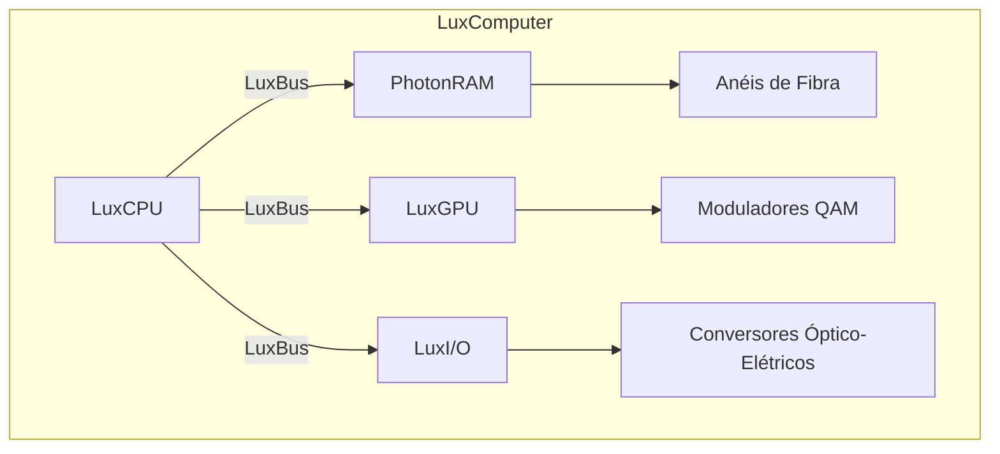
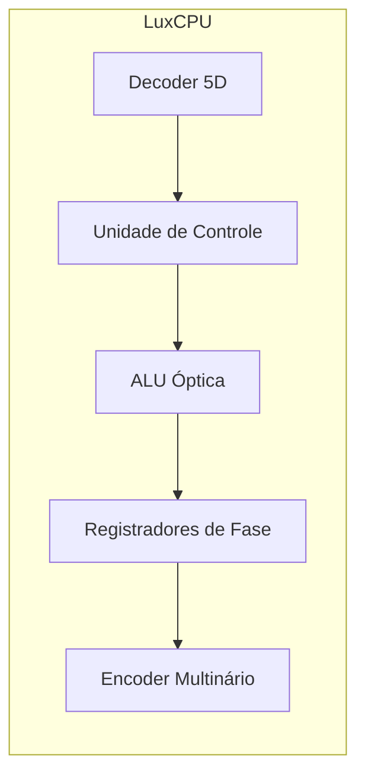
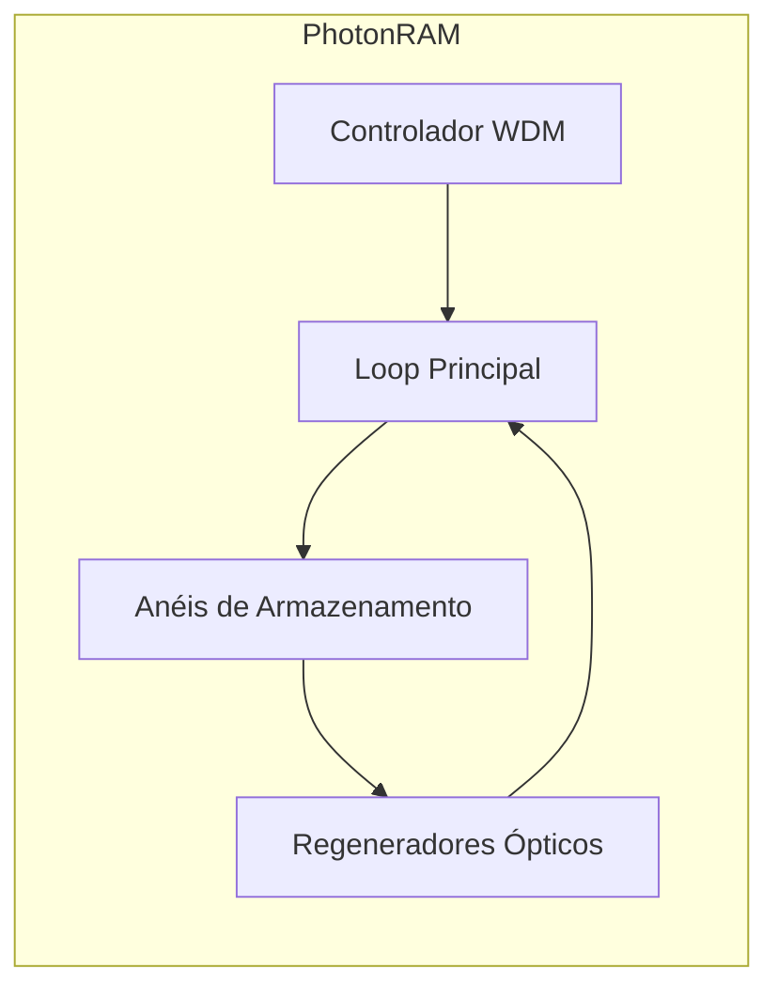
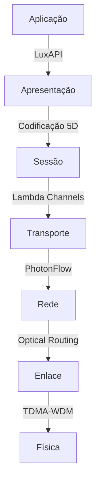
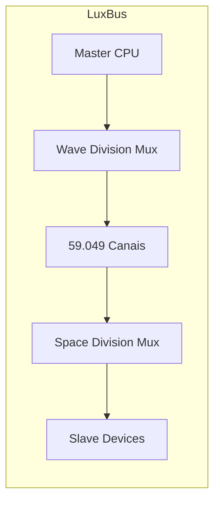
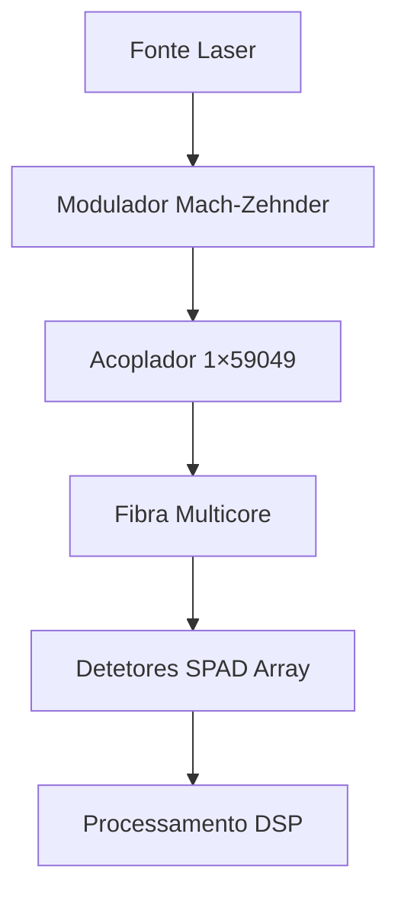
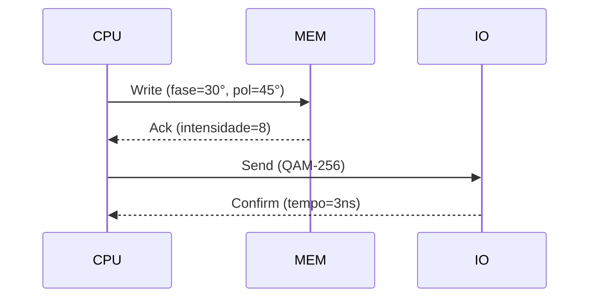
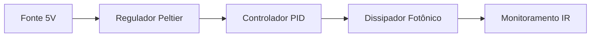
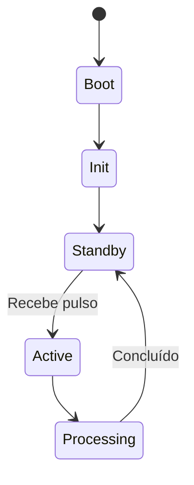
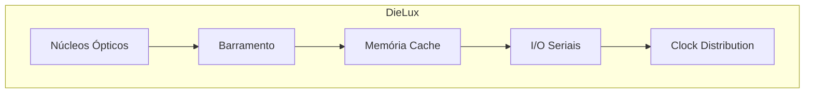

# **Lux Computer: Arquitetura Detalhada com Diagramas**

## 1. Diagrama de Blocos do Sistema Lux Complete

## 2. Componentes Físicos Detalhados

### 2.1 LuxCPU (Processador Óptico)

**Especificações Técnicas:**
- 59049 núcleos de processamento paralelo
- Clock: 5THz (modulação de fase)
- Consumo: 3.5W @ 5V

### 2.2 PhotonRAM (Memória Óptica)

**Características:**
- Capacidade: 1EB (exabyte) por cm³
- Latência: 50ps
- Tecnologia: PhotonRingStorage v2.3

## 3. Diagrama da Camada Lux-OSI

## 4. Esquema de Barramento LuxBus

**Protocolo:**
- Largura de banda: 1.2Pbps
- Modulação: QAM-4096 por canal
- Controle: SDN Óptico

## 5. Diagrama de Implementação Física

**Materiais:**
- Lasers: VCSELs 940nm
- Fibra: Cristal Fotônico (PCF)
- Detectores: Single-Photon Avalanche Diodes

## 6. Fluxo de Dados Ópticos

## 7. Diagrama de Potência e Resfriamento

**Especificações Térmicas:**
- Faixa operacional: 20°C ±0.1°C
- Eficiência: 98% @ 10THz

## 8. Diagrama de Controle

## 9. Layout de Chip VLSI

**Node: 3nm Silicon Photonics**
- Área: 225mm²
- Transistores: 59.049 milhões (fotônicos)

## 10. Diagrama de Sistemas de Arquivos Óptico

**Capacidade:**
- 1 setor = 9 canais × 9 propriedades
- Tamanho de bloco: 243 bytes (3⁵)
