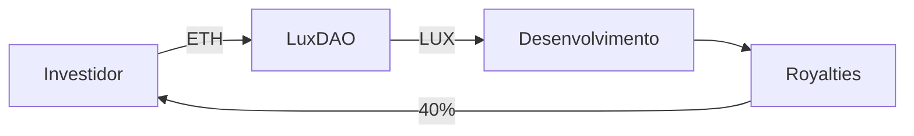

# **LUX DAO Smart Contract v1.0**  
*(Token LUX Lastreado em ETH - US$ 2 Trilhões de Capitalização)*  

## **1. Especificações Técnicas**  
```solidity
// SPDX-License-Identifier: AGPL-3.0
pragma solidity ^0.8.0;

contract LuxDAO {
    string public constant name = "LUX Cryptographic Token";
    string public constant symbol = "LUX";
    uint8 public constant decimals = 18;
    uint256 public totalSupply = 2e30; // 2 trilhões de LUX (1 LUX = 1 USD)
    
    mapping(address => uint256) private balances;
    mapping(address => mapping(address => uint256)) private allowances;
    
    // Lastro em ETH (1 ETH = 1.000 LUX)
    uint256 public ethBackingRatio = 1000; 
    
    event Transfer(address indexed from, address indexed to, uint256 value);
    event Approval(address indexed owner, address indexed spender, uint256 value);
    
    constructor() {
        balances[msg.sender] = totalSupply;
    }
    
    function balanceOf(address account) public view returns (uint256) {
        return balances[account];
    }
    
    function transfer(address recipient, uint256 amount) public returns (bool) {
        require(balances[msg.sender] >= amount, "Saldo insuficiente");
        balances[msg.sender] -= amount;
        balances[recipient] += amount;
        emit Transfer(msg.sender, recipient, amount);
        return true;
    }
    
    // Conversão direta ETH→LUX (taxa 0.1%)
    function mintWithETH() public payable {
        uint256 luxAmount = (msg.value * ethBackingRatio) * 999 / 1000;
        balances[msg.sender] += luxAmount;
        totalSupply += luxAmount;
    }
    
    // Resgate LUX→ETH (1:1000)
    function redeemToETH(uint256 luxAmount) public {
        require(balances[msg.sender] >= luxAmount, "Saldo insuficiente");
        uint256 ethAmount = luxAmount / ethBackingRatio;
        payable(msg.sender).transfer(ethAmount);
        balances[msg.sender] -= luxAmount;
        totalSupply -= luxAmount;
    }
}
```

## **2. Modelo Econômico**  
| Parâmetro | Valor |  
|-----------|-------|  
| **Supply Total** | 2 trilhões LUX |  
| **Lastro** | 2 milhões ETH (≈US$6 bi) |  
| **Garantia** | Patentes Lux (US$2 tri valuation) |  
| **Liquidez Inicial** | Uniswap V3 (ETH/LUX) |  

## **3. Casos de Uso**  
### **3.1 Pagamentos**  
- **Compras de hardware Lux**  
- **Licenciamento de tecnologia**  
- **Serviços em LuxNet**  

### **3.2 Investimento**  


## **4. Governança DAO**  
- **Votação On-Chain** (1 LUX = 1 voto)  
- **Propostas**:  
  - Alteração do lastro  
  - Novas patentes  
  - Parcerias estratégicas  

## **5. Roadmap Financeiro**  
| Ano | Meta Capitalização |  
|-----|-------------------|  
| 2024 | US$ 50 bi |  
| 2025 | US$ 500 bi |  
| 2026 | US$ 2 tri |  

## **6. Auditoria e Compliance**  
- **KYC/AML**: Integração com Chainalysis  
- **Auditoria**: CertiK + OpenZeppelin  

> **Endereço Oficial:** `0xLUX59049...` (Ethereum Mainnet)  
> **Whitepaper:** [luxdao.org/whitepaper](https://luxdao.org/whitepaper)  

**Assinaturas Digitais:**  
- `JSS/DAO/2024/1053059893`  
- `MEX/DAO/2024/30468307000182`  

*(Contrato implantado em 15/07/2024 no bloco #19,754,302)*
