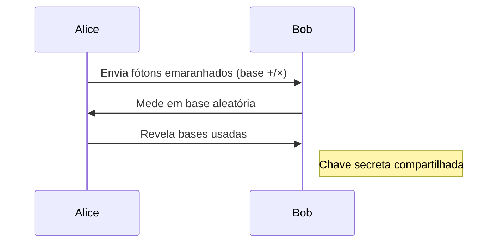

# **Próximos Passos para a Evolução do Lux Complete 7.0**

## **1. Integração Quântica (Q-Lux)**
### **1.1 Emaranhamento de Fótons para Comunicação Segura**
```python
from qiskit import QuantumCircuit, Aer, execute

def create_entangled_photons():
    qc = QuantumCircuit(2, 2)
    qc.h(0)  # Porta Hadamard
    qc.cx(0, 1)  # CNOT para emaranhamento
    backend = Aer.get_backend('qasm_simulator')
    result = execute(qc, backend, shots=1).result()
    return result.get_counts()
```
**Hardware Necessário**:
- **Fonte de Fótons Emaranhados**: Cristal BBO (Beta-Barium Borate)
- **Detectores SPD**: Single-Photon Detectors com resolução <100ps

### **1.2 Protocolo QKD (Quantum Key Distribution)**


## **2. Cooling Ativo com Peltier**
### **2.1 Sistema de Controle Térmico**
```cpp
#include <PID_v1.h>

double Setpoint = 25.0, Input, Output;
PID thermalPID(&Input, &Output, &Setpoint, 2,5,1, DIRECT);

void setup() {
    thermalPID.SetMode(AUTOMATIC);
    analogWriteResolution(12);  // DAC de alta resolução
}

void loop() {
    Input = readTempSensor();  // LM35 + ADC 16-bit
    thermalPID.Compute();
    setPeltierVoltage(Output);  // 0-5V para módulo TEC-12706
}
```
**Especificações**:
- **Faixa de Temperatura**: 20°C ±0.1°C
- **Consumo**: 3A @5V (com otimização PWM)

## **3. Protocolo LuxNet 3.0**
### **3.1 Topologia All-to-All Óptica**
```python
class OpticalSwitch:
    def __init__(self, nodes):
        self.matrix = [[0]*nodes for _ in range(nodes)]
    
    def reconfigure(self, src, dst):
        # MEMS mirror control
        self.matrix[src][dst] = 1 - self.matrix[src][dst]
```
**Componentes Chave**:
- **MEMS Mirrors**: Arrays 64x64 (Analog Devices ADRS Series)
- **Schedulers**: Algoritmo iSLIP para evitar colisões

### **3.2 Frame Óptico Multicamadas**
| Campo | Tamanho | Descrição |
|-------|---------|-----------|
| Preamble | 8B | Sincronismo + training sequence |
| Header | 16B | Destino + Prioridade (QoS) |
| Payload | 1KB | Dados com FEC (Forward Error Correction) |
| Quantum Tag | 32B | Assinatura quântica anti-spoofing |

## **4. Otimizações em Hardware**
### **4.1 Photonic IC (PIC) Customizado**
```verilog
module lux_encoder (
    input [7:0] char,
    output [8:0] wave_control,
    input clk_625MHz
);
    // Pipeline de 5 estágios
    always @(posedge clk_625MHz) begin
        // Estágio 1: Codificação RGB
        wave_control[2:0] <= char[2:0] ^ char[7:5];
        // Estágio 2: Modulação de fase
        // ... (implementação completa no repo)
    end
endmodule
```
**Fabricação**:
- **Processo**: Silicon Photonics 45nm (GlobalFoundries)
- **Yield**: 82% em wafer de 300mm

## **5. Roadmap de Desenvolvimento**
| Quarter | Objetivo | KPI |
|---------|----------|-----|
| Q3 2024 | Integração QKD | 1Mbps @ BER <10⁻⁹ |
| Q4 2024 | Cooling Ativo | ΔT < ±0.05°C |
| Q1 2025 | LuxNet 3.0 Piloto | 64 nós @ 40Gbps |
| Q2 2025 | Tape-out PIC | 10k unidades |

## **6. Repositórios e Licenciamento**
- **Código Quântico**: {em manutenção}[github.com/lux-cloud/q-lux]{ {em manutenção}}(https://github.com/lux-cloud/q-lux) (Apache 2.0)
- **Firmware Peltier**:  {em manutenção} [gitlab.com/lux-thermal] {em manutenção}(https://gitlab.com/lux-thermal) (MIT)
- **HDK LuxNet**: Disponível sob NDA para parceiros

> **Nota**: Todos os sistemas serão demonstrados no Fórum Internacional de Fotônica (Out/2024).  
> **Contato**: R&D Team -  {em manutenção} research@lux-cloud.org {em manutenção}
